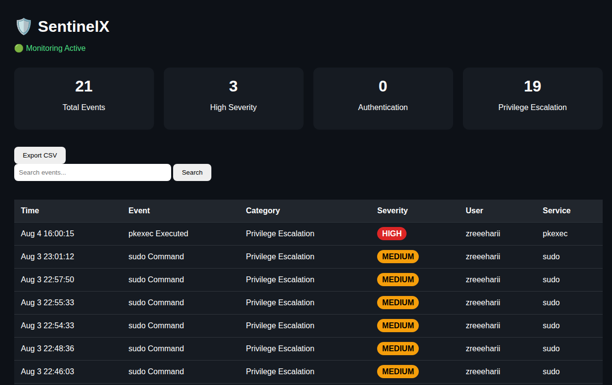
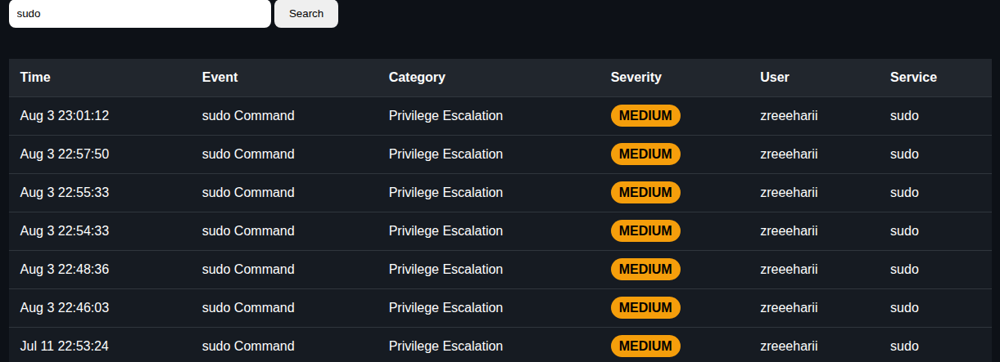

# 🛡️ SentinelX

**A Lightweight Linux Log Analysis & Mini SIEM built with Python, Flask, and SQLite.**

SentinelX is a cybersecurity monitoring tool that parses Linux authentication logs, detects suspicious activities, stores events in a SQLite database, and presents them through a modern web dashboard with analytics and CSV export.

---

## ✨ Features

* 🔍 Parse Linux `auth.log`
* 🚨 Detect suspicious security events
* 💾 Store events in SQLite
* 📊 Interactive Flask dashboard
* 📈 Severity & category analytics using Chart.js
* 🔎 Search and filter events
* 📥 Export events to CSV
* 🟢 Auto-refresh dashboard for near real-time monitoring

---

## 🖥️ Dashboard

The dashboard provides:

* Total security events
* High severity event count
* Authentication event count
* Privilege escalation event count
* Severity distribution chart
* Event category chart
* Search functionality
* CSV export

---

## 🛠️ Tech Stack

* **Language:** Python 3
* **Framework:** Flask
* **Database:** SQLite
* **Frontend:** HTML, CSS, JavaScript
* **Charts:** Chart.js
* **Platform:** Ubuntu 22.04 LTS

---

## 📂 Project Structure

```text
SentinelX/
├── app.py
├── config.py
├── requirements.txt
├── .gitignore
├── modules/
│   ├── parser.py
│   ├── detector.py
│   ├── database.py
│   └── watcher.py
├── templates/
├── static/
├── database/
├── logs/
└── screenshots/
```

---

## ⚙️ Installation

```bash
git clone https://github.com/YOUR_USERNAME/SentinelX.git

cd SentinelX

python3 -m venv venv

source venv/bin/activate

pip install -r requirements.txt

python app.py
```

Open your browser and visit:

```text
http://127.0.0.1:5000
```

---

## 📸 Screenshots

Create a `screenshots/` folder and add images such as:

* `dashboard.png`
* `charts.png`
* `search.png`
* `export.png`

Then reference them here:

```markdown




```

---

## 🚀 Future Improvements (v2.0)

* Real-time log streaming
* Advanced brute-force attack detection
* Email alerts
* GeoIP integration
* Docker support
* REST API enhancements
* AI-assisted threat summaries
* Cross-platform support (Linux & Windows)

---

## 👨‍💻 Author

**Sreehari**

Computer Science Engineering Student

Passionate about Cybersecurity, Networking, Linux, and Python Development.

---

## 📄 License

This project is released under the MIT License.

---

⭐ If you found this project useful, consider giving it a star!
